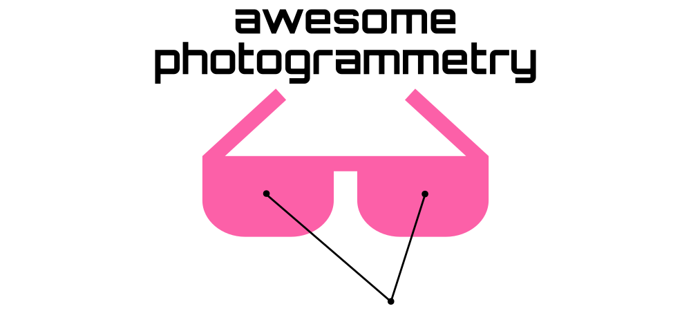

This repo is a collection of AWESOME photogrammetry projects, applications, tools, resources. 

Items marked with ![Open-Source Software][OSS Icon] are open-source software and link to the source code. Items marked with ![Commercial Software][Money Icon] are nonfree and may cost money to use.

Feel free to **contribute** / **star** / **fork** / **pull request** . Any **recommendations** and **suggestions** are welcome.

# Table of Contents

- [Definition](#definition)
- [Photogrammetric software](#photogrammetric-software)
- [Structure from motion (SFM) software](#structure-from-motion-sfm-software)
- [Calibration software](#calibration-software)
- [Least squares optimization libraries](#least-squares-optimization-libraries)
- [Datasets and benchmarks](#datasets-and-benchmarks)
- [Journals](#journals)
- [Conference proceedings](#conference-proceedings)
- [Books](#books)
- [Introductory and review papers](#introductory-and-review-papers)
- [Courses and tutorials](#courses-and-tutorials)
- [Scientific conferences](#scientific-conferences)
- [Related awesome lists](#related-awesome-lists)
- [License](#license)
- [Acknowledgments](#acknowledgments)

## Definition

Definition of **photogrammetry** according to K. Schindler and W. Förstner:

> "Photogrammetry is the science and technology of obtaining information about the physical environment from images, with a focus on applications in surveying, mapping and high-precision metrology. The aim of photogrammetry is to provide automated or semi-automated procedures for these engineering tasks, with emphasis on a specified accuracy, reliability, and completeness of the information."

Source: [Photogrammetry](https://ethz.ch/content/dam/ethz/special-interest/baug/igp/photogrammetry-remote-sensing-dam/documents/pdf/Papers/Photogrammetry%202020.pdf) by K. Schindler and W. Förstner (2020). In: [Computer Vision: A Reference Guide, 2nd edition](https://www.springer.com/gp/book/9783030634155).

## Photogrammetric software

* ![Commercial Software][Money Icon] [Agisoft Metashape](https://www.agisoft.com)
* ![Open-Source Software][OSS Icon] [MicMac](https://micmac.ensg.eu)
* ![Open-Source Software][OSS Icon] [MVE](https://github.com/simonfuhrmann/mve) 
* ![Open-Source Software][OSS Icon] [OpenDroneMap](https://github.com/OpenDroneMap/ODM) 
* ![Commercial Software][Money Icon] [Pix4D](https://www.pix4d.com)
* ![Commercial Software][Money Icon] [RealityCapture](https://www.capturingreality.com)
* ![Commercial Software][Money Icon] [SURE by nFrames](https://www.nframes.com)
* ![Open-Source Software][OSS Icon] [TeleSculptor](https://github.com/Kitware/TeleSculptor) 
* ![Commercial Software][Money Icon] [Trimble Inpho](https://geospatial.trimble.com/products-and-solutions/inpho)

## Structure from motion (SFM) software

* ![Open-Source Software][OSS Icon] [BoofCV](https://colmap.github.io/index.html)  - Includes Structure-from-Motion, Multi-View Stereo, and Android Support
* ![Open-Source Software][OSS Icon] [Bundler](https://github.com/snavely/bundler_sfm/)  - SFM system for unordered image collections
* ![Open-Source Software][OSS Icon] [COLMAP](https://colmap.github.io/index.html)  - Structure-from-Motion and Multi-View Stereo
* ![Open-Source Software][OSS Icon] [Meshroom](https://github.com/alicevision/meshroom)  - 3D Reconstruction Software
* ![Open-Source Software][OSS Icon] [openMVG](https://github.com/openMVG/openMVG)  - Multiple View Geometry library
* ![Open-Source Software][OSS Icon] [openSFM](https://github.com/mapillary/OpenSfM/)  - Structure from Motion library written in Python
* ![Open-Source Software][OSS Icon] [VisualSFM](http://ccwu.me/vsfm/) - GUI application for 3D reconstruction using SFM

## Calibration software

* ![Open-Source Software][OSS Icon] [BoofCV](https://colmap.github.io/index.html)  Single, Stereo, Guided Calibration, Multi-view Self Calibration, Many Fiducals, Many Camera Models, Command line and GUI
* ![Open-Source Software][OSS Icon] [camera_calibration](https://github.com/puzzlepaint/camera_calibration)  - Accurate geometric camera calibration
* ![Open-Source Software][OSS Icon] [kalibr](https://github.com/ethz-asl/kalibr)  - Multi-camera, visual-inertial and rolling shutter camera calibration toolbox
* ![Open-Source Software][OSS Icon] [mrcal](http://mrcal.secretsauce.net)  - Toolkit for camera calibration and more

## Least squares optimization libraries

* ![Open-Source Software][OSS Icon] [Ceres solver](http://ceres-solver.org)  - C++ library for modeling and solving large, complicated optimization problems
* ![Open-Source Software][OSS Icon] [dlib/optimization](http://dlib.net/optimization.html)  - C++ toolkit which provides also functions for solving least-squares problems
* ![Open-Source Software][OSS Icon] [g2o](https://github.com/RainerKuemmerle/g2o)  - C++ framework for optimizing graph-based nonlinear error functions
* ![Open-Source Software][OSS Icon] [GTSAM](https://gtsam.org/)  - C++ library for factor graphs and bayes networks optimizations towards SLAM, VO and SFM
* ![Open-Source Software][OSS Icon] [lmfit](https://lmfit.github.io/lmfit-py/)  - Python package which builds on and extends many of the optimization methods of [scipy.optimize](https://docs.scipy.org/doc/scipy/reference/optimize.html)
* ![Open-Source Software][OSS Icon] [scipy.optimize.least_squares](https://docs.scipy.org/doc/scipy/reference/generated/scipy.optimize.least_squares.html)  - Powerful least-squares optimization function for python
* ![Commercial Software][Money Icon] [Matlab/OptimizationToolbox](https://www.mathworks.com/products/optimization.html) - Toolbox for local optimizations, including functions for solving least squares problems

## Datasets and benchmarks

* [Bundle adjustment in the large](https://grail.cs.washington.edu/projects/bal/) - Bundle adjustment data sets for five different scenes (2010)
* [Hessigheim 3D (H3D) benchmark](https://ifpwww.ifp.uni-stuttgart.de/benchmark/hessigheim/default.aspx) - Benchmark on semantic segmentation of high-resolution 3D point clouds and textured meshes (2021)

## Journals

* [ISPRS Journal of Photogrammetry and Remote Sensing](https://www.journals.elsevier.com/isprs-journal-of-photogrammetry-and-remote-sensing) (SNIF=3.006)
* [Open ISPRS Journal of Photogrammetry and Remote Sensing](https://www.journals.elsevier.com/isprs-open-journal-of-photogrammetry-and-remote-sensing)
* [Photogrammetric Engineering & Remote Sensing (PE&RS)](https://www.asprs.org/asprs-publications/pers) (SNIF=1.425)
* [PFG – Journal of Photogrammetry, Remote Sensing and Geoinformation Science](https://www.springer.com/journal/41064) (SNIF=0.682)
* [Remote Sensing](https://www.mdpi.com/journal/remotesensing) (SNIF=1.661)
* [Remote Sensing of Environment](https://www.journals.elsevier.com/remote-sensing-of-environment) (SNIF=2.943)
* [The Photogrammetric Record](https://onlinelibrary.wiley.com/journal/14779730) (SNIF=1.758)

Last update of [source normalized impact factors (SNIF)](https://en.wikipedia.org/wiki/Journal_ranking#SNIP) according to www.journalguide.com: 2021-03-05

## Conference proceedings

* [ISPRS Annals](https://www.isprs.org/publications/annals.aspx)
* [ISPRS Archives](https://www.isprs.org/publications/archives.aspx)

## Books

* [Close-Range Photogrammetry and 3D Imaging](https://www.degruyter.com/view/title/539949) by T. Luhmann, S. Robson, S. Kyle and J. Boehm (2014)
* [Observations and Least Squares](https://www.amazon.com/Observations-Least-Squares-Edward-Mikhail/dp/0819123978) by E. Mikhail (1983)
* [Photogrammetric Computer Vision](https://www.springer.com/de/book/9783319115498) by W. Förstner and B. P. Wrobel (2016)
* [Photogrammetrie und Fernerkundung](https://www.springer.com/de/book/9783662470930) (german) by C. Heipke (editor) (2017)
* [Photogrammetry - Geometry from Images and Laser Scans](https://doi.org/10.1515/9783110892871) by K. Kraus (2011)

## Introductory and review papers

* [Mathematical foundations of photogrammetry](https://www.research-collection.ethz.ch/handle/20.500.11850/93024) by K. Schindler (2014)
* [UAV for 3D mapping applications: a review](https://link.springer.com/article/10.1007/s12518-013-0120-x) by F. Nex and F. Remondino (2013)
* [Unmanned aerial systems for photogrammetry and remote sensing: A review](https://www.sciencedirect.com/science/article/pii/S0924271614000501) by I. Colomina and P. Molina (2014)

## Courses and tutorials

* [Photogrammetry I course by Cyrill Stachniss at the University of Bonn](https://www.youtube.com/playlist?list=PLgnQpQtFTOGRsi5vzy9PiQpNWHjq-bKN1) (2015) 
* [Photogrammetry II course by Cyrill Stachniss at the University of Bonn](https://www.youtube.com/playlist?list=PLgnQpQtFTOGQEXN2Qo571uvwIGNGAM8uf) (2020)

## Scientific conferences

* [ISPRS conferences](https://www.isprs.org/calendar/Default.aspx)

## Related awesome lists

* [Awesome Computer Vision](https://github.com/jbhuang0604/awesome-computer-vision) 
* [Awesome Geospatial](https://github.com/sacridini/Awesome-Geospatial) 
* [Awesome Lidar](https://github.com/szenergy/awesome-lidar) 
* [Awesome Robotics](https://github.com/kiloreux/awesome-robotics)
* [Awesome 3D Reconstruction](https://github.com/openMVG/awesome_3DReconstruction_list) 

## License

This work is licensed under a [Creative Commons Attribution 4.0 International License](https://creativecommons.org/licenses/by/4.0/).

## Acknowledgments

Icons created by <a href="https://www.flaticon.com/authors/pixel-perfect" title="Pixel perfect">Pixel perfect</a> and <a href="https://www.flaticon.com/authors/freepik" title="Freepik">Freepik</a> from <a href="https://www.flaticon.com/de/" title="Flaticon"> www.flaticon.com</a>

[OSS Icon]: ./img/oss.svg
[Money Icon]: ./img/money.svg
